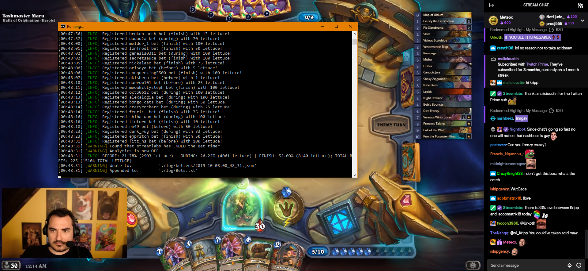

# hellockedz
An analytics bot made to work mining Kripparian's (nl_kripp) chat.

### Bot in execution while/after bets

### This is a BOT created with with _nodejs_ and the _twitch-js_ module to analyze the !bet system in nl_kripp's channel.

It only reads for each nickname the bets in the format "_!bet low|mid|high {number}_" and can provide statistics such as how many people voted, how many in each tier and the lettuce statistics.  
  
  
**It's by no means affiliated with Kripparian or his channel**; it's a **personal project** that I wanted because I'm a curious little one
And sorry, mods, if it was obnoxious enough to warrant a ban. Mah bad.
  
  
>Use _npm install_ with the package.json and it should work. Edit the **oath key, the channel and nickname** and voilá.
  
(it also happens to have a _!watweather_ command with the _weather-js_ module, just for interesting fun)
  
    
    
#### PS: ALTHOUGH IT'S POSSIBLE FOR THE BOT TO SEND MESSAGES TO THE CHANNEL, I HAVE MANUALLY COMMENTED/REMOVED ALL LINES THAT WOULD DO SO, THEREFORE YOU'LL HAVE ACCESS TO THE ANALYTICS **IN YOUR CONSOLE ONLY** MEANING THAT **THE BOT WILL NEVER SEND MESSAGES TO KRIPP'S CHANNEL**  
    
    
- lockedz 05/07/2019 (inutil.mente@yahoo.com.br)

-----------------------------

Update:
- Changed a lot of things. Since the bot was/is banned (it's not allowed at all to have automatic responses or messages), I did this more as a personal hobby. It works pretty close with Streamlabs (automatic checking when bets have opened, you have that option in the code);

- Change at ./bin/globals.js line 20 the "Bot" to watch for the bets (Streamlabs) in Kripp's case;

- Change at ./obj/options.js line 9, 10 and 12 with the bot nick, bot oath hash and channel(s) to mine respectively;

- Change at ./obj/Bot.js line 7 the "bot owner". Some commands depend on the owner/are only owner available;

### CHANGELOG
#### 23/09/2019
- Added support for PvE bets (Kripp's PvE bets are: 'before' (low tier), 'during' (mid tier) and 'finish' (high tier);

#### 09/10/2019
- Refactor of some code from index.js to Analytics.js
- I thought that the bot was defaulting bets that were > MAX_BET_VALUE to MAX_BET_VALUE itself. It is not. It won't be considered a valid bet and no writing done. This behavior is intended
